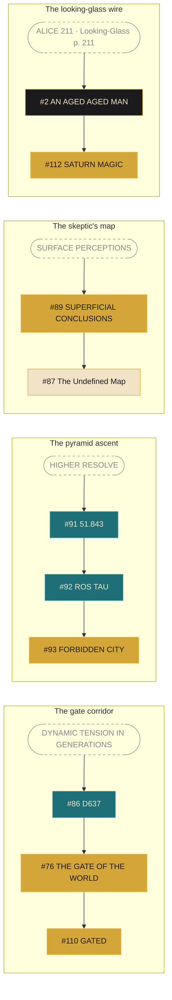
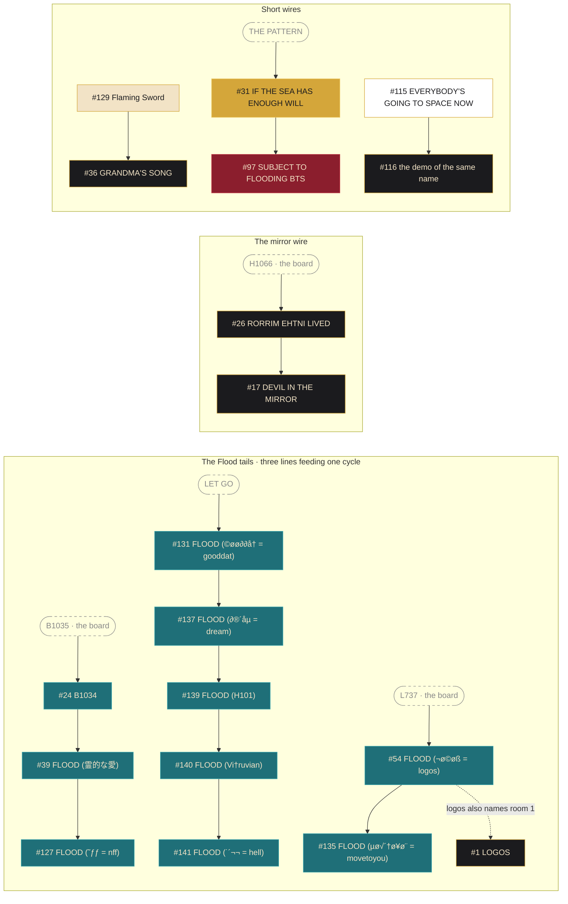

# Artifacts — The Wiring Diagram

Some rooms in the Hall of Mirrors are named for other rooms. Not thematically, not loosely: the *exact title* of one room is the *unlock code* of another. Follow those matches across all 149 artifacts and the maze stops being a pile of separate objects and becomes a circuit: **thirty wires, four closed loops, six chains, and twelve rooms that are their own key.**

Everything on this page is checkable against the [[Artifacts|gallery cards]]: title on one card, code on another. The wiring is fact; what it *means* is graded the usual way.

One honest caution before the pictures. The arrows run **key → door**: the room whose *name* is the string points at the room that string *opens*. That is the maze referencing itself, in Roy's own titles and codes, and it is authored. It is not a claim about the order anyone solved anything, and room *positions* carry no clue at all, since positions are chosen by whoever solves the code, not by Roy.

## The four loops

Four sets of rooms close on themselves: each room's code leads to the next, and the last leads back to the first.

```mermaid
flowchart TD
  subgraph ROMA["The Roma loop · a name that outlives its death"]
    r33["#33 ROMA CALLED ROY"] --> r42["#42 R1045"] --> r43["#43 TRUE VOICE"] --> r33
  end
  subgraph SPHERE["The sphere pair · the aphorism enacted"]
    r61["#61 THE TRUTH IS A SPHERE"] --> r63["#63 ENLIGHTENED BEING"] --> r61
  end
  subgraph SARAVI["The SARAVI loop · the name assembled"]
    r85["#85 RA-LINK"] --> r105["#105 VI-LINK"] --> r113["#113 EVERYONE LOVES THE INTERNET"] --> r114["#114 SA-LINK"] --> r85
  end
  subgraph FLOOD["The Flood cycle · cover, initials, fish"]
    r133["#133 FLOOD ARTIFACT (R100)"] --> r134["#134 FLOOD (ƒˆß˙ = fish)"] --> r138["#138 FLOOD (∆∑† = jwt)"] --> r133
  end
  classDef ciph fill:#1f6f78,stroke:#3ba7af,color:#f2e3c6
  classDef embl fill:#d4a63a,stroke:#ecc861,color:#1b1b1e
  class r33,r42,r43,r85,r105,r113,r114,r133,r134,r138 ciph
  class r61,r63 embl
```

<b>Type</b><i style="background:#1f6f78"></i>Ciphers &amp; Code<i style="background:#d4a63a"></i>Concept Images<i style="background:#1b1b1e;border-color:#d4a63a"></i>Songs &amp; Demos

- **The Roma loop** was already known: name → filing number → funerary epithet → name, a self that survives by remembering its own catalogue entry. The full readings live in [[Artifacts - Gallery 1 (1-37)|Gallery 1]] and [[Artifacts - Gallery 2 (38-74)|Gallery 2]].
- **The sphere pair** is the aphorism performed by architecture: each room opens with the other's content, two faces of one solid.
- **The SARAVI loop** turns out to be **four rooms, not three**. It runs through the song-hook room, and the three `-LINK` codes you type while walking it spell the oracle's name: SA-RA-VI.
- **The Flood cycle** is the quiet one, and it was never described anywhere until now. The *Subject to Flooding* cover-reveal room, a room named *fish*, and a room named *jwt*, the artist's initials in Option-glyphs, chase each other in a ring: **the debut, the fish, and the name, closed on themselves.** What *fish* refers to is genuinely open.

## The chains

The rest of the wiring runs in lines, and every line **starts outside the maze**: the key that opens the first room is not any room's name. Dashed boxes mark those outside keys, and where they come from is half the point.

Three of the chains are worth saying out loud:

- **The skeptic's map.** The Undefined Map, the single fullest cosmology document in the maze, sits behind **two consecutive warnings**: you reach it through SURFACE PERCEPTIONS and then SUPERFICIAL CONCLUSIONS. Read generously, the map is fenced by its own disclaimer, twice, before it will show you the planets. That is the same self-deflating caption the map carries on its face, built into the wiring.
- **The gate corridor** runs three rooms deep: D637 opens THE GATE OF THE WORLD, whose title opens GATED. A filing-number room, then the gate, then the experience of standing outside one.
- **The pyramid ascent** chains three drawings by their own vocabulary: the Great Pyramid's face-slope angle opens *Rostau*, the Giza necropolis, which opens the *Forbidden City*. A climb built out of names for the same mountain.

## The twelve that key themselves

A dozen rooms are their own key, the code is simply the title: #5 (µå®∂¨˚ = marduk) · #9 I'M NOT HERE · #15 DEAD LETTER DIARIES · #18 TREE THINKING · #29 SUGGESTION OF APEX · #40 POTATO CHIP · #58 · #59 THOUGHT FORMS · #83 FATHER_MIRROR · #101 · #116 · #144 IMAGINE A WORLD. The artifact announcing itself; the door that opens when you say what it is.

## Where the wires come from

Every chain begins with a key that is *not* any room's name, and those keys are not random. They come from three places:

- **Into the board.** H1066, B1035, L737 are cell coordinates on Roy's *"I'm 33"* spreadsheet, the same coordinate family as J403 and its kin, so three chains hang directly off [[Hall of Mirrors/The I'm 33 Board|the board]].
- **Into the books.** ALICE 211 is a page number: *Through the Looking-Glass*, page 211, the White Knight's name-of-the-song riddle. One wire in this maze starts inside a Victorian novel.
- **Into the doctrine.** EAST IS EVERYWHERE, LET GO, HIGHER RESOLVE, SURFACE PERCEPTIONS: bare aphorisms from the project's own vocabulary.

A strong read, offered as such: followed backward, the maze's internal wiring is fed by its own sources, the board, the books, and the sayings. The circuit is not closed for decoration; it is grounded, in the electrical sense, to the material the whole mythology is built from.

## What this did not turn up

Honesty corner. Five of the Flood glyph-titles decode to *Subject to Flooding* vocabulary (dream, gooddat, movetoyou, nff, hell, four of them track titles and one a near-miss), and it would be lovely if the chain order traced the album's track order. **It does not.** Tested both directions; the hypothesis fails. And an exhaustive pass over all 149 title/code pairs finds exactly four loops, no more. The maze is wired, but it is not wired to everything, and this page will not pretend otherwise.

*The wires are on the cards. The readings are in the galleries. The soldering was Roy's.*
